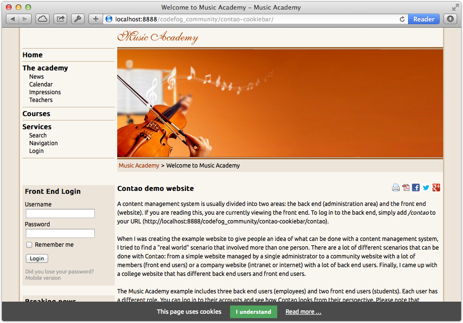

# Cookiebar – Documentation

## Configuration

The cookiebar is configured per each website root. To enable it, go to the Site structure and edit the desired root page. 
There you will have to enter text that will be displayed, the label of close button and bar position. Additionally, 
you can also choose the details page that will appear as the `"read more"` link in the bar.


The bar will then appear in the front end. Please note that you **do not need** any JavaScript library like MooTools or 
jQuery to make it work.



## Change appearance

The cookiebar can be easily styled using CSS:

```css
#cookiebar {
    background-color: #eaeaea;
    border-top: 1px solid #b1b1b1;
    color: #000000;
}
 
#cookiebar button {
    background-color: #00adff;
}
 
#cookiebar a {
    color: #a84204;
}
```

