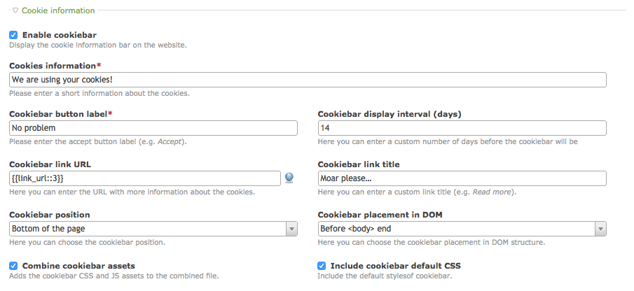

# Cookiebar – Documentation

## Configuration

The cookiebar is configured per each website root. To enable it, go to the Site structure and edit the desired root page.
There you will have to enter text that will be displayed, the label of close button and bar position. Additionally,
you can also choose the details page that will appear as the `"read more"` link in the bar.



The bar will then appear in the front end. Please note that you **do not need** any JavaScript library like MooTools or
jQuery to make it work.


## Analytics handling

To support the analytics opt-out, apart from checking the analytics box in cookiebar settings, you will also need
to adjust your Google Analytics / Piwik script. This feature can't come out of the box as the analytics implementation
can be different for every website.

The analytics checkbox in cookiebar when checked will create an item in the browser's `localStorage`
named `COOKIEBAR_ANALYTICS`. In order to check whether it is present or not, you can simply use this snippet:

```js
var disabled = !!localStorage.getItem('COOKIEBAR_ANALYTICS');
```

Here is an example of adjusted `analytics_google.html5` template from Contao 3.5 (make sure you do NOT accidentally
copy also the "+" sign in at the beginning of the line – it is only used to highlight the line which has been changed):

```diff
<?php

/**
 * To use this script, please fill in your Google Analytics ID below
 */
$GoogleAnalyticsId = 'UA-XXXXX-X';


/**
 * DO NOT EDIT ANYTHING BELOW THIS LINE UNLESS YOU KNOW WHAT YOU ARE DOING!
 */
if ($GoogleAnalyticsId != 'UA-XXXXX-X' && !BE_USER_LOGGED_IN && sha1(session_id() . (!Config::get('disableIpCheck') ? Environment::get('ip') : '') . 'BE_USER_AUTH') != Input::cookie('BE_USER_AUTH')): ?>

<script>
+  window['ga-disable-<?= $GoogleAnalyticsId ?>'] = !!localStorage.getItem('COOKIEBAR_ANALYTICS');
  (function(i,s,o,g,r,a,m){i['GoogleAnalyticsObject']=r;i[r]=i[r]||function(){(i[r].q=i[r].q||[]).push(arguments)},i[r].l=1*new Date();a=s.createElement(o),m=s.getElementsByTagName(o)[0];a.async=1;a.src=g;m.parentNode.insertBefore(a,m)})(window,document,'script','https://www.google-analytics.com/analytics.js','ga');
  ga('create', '<?= $GoogleAnalyticsId ?>', 'auto');
  <?php if (Config::get('privacyAnonymizeGA')): ?>
    ga('set', 'anonymizeIp', true);
  <?php endif; ?>
  ga('send', 'pageview');
</script>

<?php endif; ?>

```

## Change appearance

The cookiebar can be easily styled using CSS:

```css
.cookiebar {
    background-color: #eaeaea;
    border-top: 1px solid #b1b1b1;
    color: #000000;
}

.cookiebar__button {
    background-color: #00adff;
}

.cookiebar__link {
    color: #a84204;
}
```

## Troubleshooting

If your cookiebar is not displayed it may be related to the fact that you use the XHTML page layout. The extension
does not provide XHTML support out of the box. To fix this problem, you may need need to create the `cookiebar.xhtml`
template based on the genuine `cookiebar.html5`.
